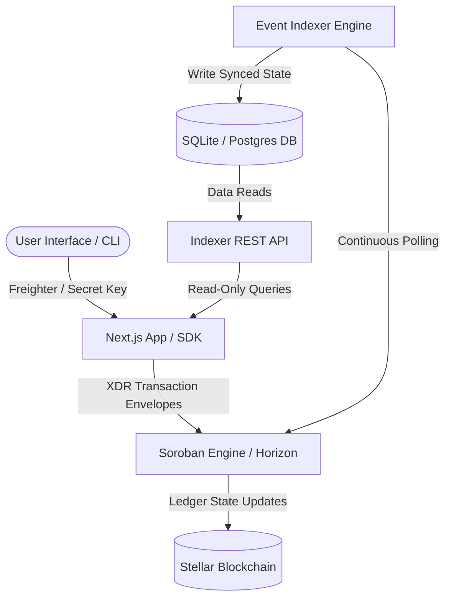
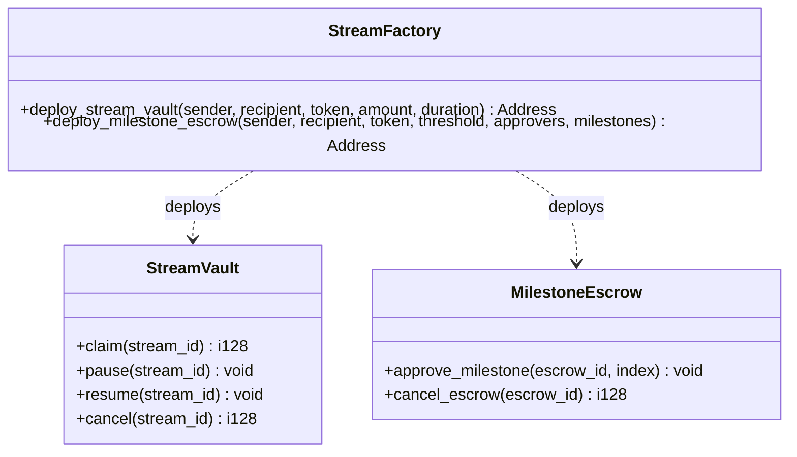
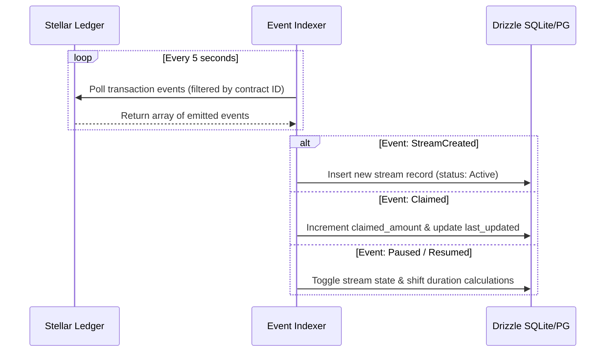
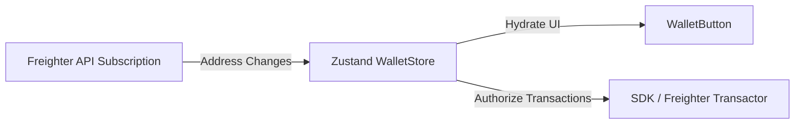

# PayFlow Protocol: System Architecture & Data Flow

This document provides a deep architectural breakdown of the PayFlow Protocol—a decentralized payment streaming and milestone-gated disbursement platform native to Stellar's Soroban smart contract ecosystem.

---

## 1. System Topology Overview

PayFlow utilizes a hybrid decentralized topology, combining the robust settlement guarantees of on-chain Soroban contracts with a high-performance event-driven indexer to power a responsive Next.js frontend and a developer CLI.

---

## 2. On-Chain Contracts (`/contracts`)

The protocol core logic is implemented across three discrete, modular smart contracts:

### StreamVault
Manages the lifecycle of continuous token payment flows. Senders lock the total balance up front, which the recipient can claim continuously down to the second. Supports pause, resume, and cancellation events.

### MilestoneEscrow
A multi-milestone locked token vault. Disbursing funds requires a multi-sig quorum approval from a list of authorized addresses. Senders can reclaim unreleased funds if the escrow is cancelled before completion.

### StreamFactory
A lightweight registry/factory contract used to deploy and register verified instances of `StreamVault` and `MilestoneEscrow` dynamically, reducing gas deployment costs for users.

---

## 3. Off-Chain Indexing & Database Sync (`/packages/indexer`)

To provide instant load times and filterable historical charts, the indexer polls the Stellar Horizon API for events emitted by verified PayFlow contract IDs:

### Relational Database Schema (`src/db/schema.ts`)
1. **streams**: Stores `id`, `sender`, `recipient`, `token`, `total_amount`, `claimed_amount`, `start_time`, `end_time`, `status`, and `last_updated_timestamp`.
2. **escrows**: Stores `id`, `sender`, `recipient`, `token`, `total_amount`, `threshold`, `approvers` (as serialized array), and `cancelled` boolean status.
3. **milestones**: Linked to `escrows` via 1-to-many relationship, tracking `title`, `amount`, `released` status, and `approvals` array.

---

## 4. Front-End State Management (`/apps/web`)

The Next.js 14 frontend uses Zustand to store global wallet address state and integrates requestAnimationFrame for real-time progress calculations:

### High-Frequency Progress Loops
To achieve buttery-smooth streaming progress displays without overloading React's render cycles, `StreamCard` utilizes an off-screen ticker powered by `requestAnimationFrame`. The component reads the static stream start/end times and updates the DOM progress bar and counter directly at 60 FPS.

