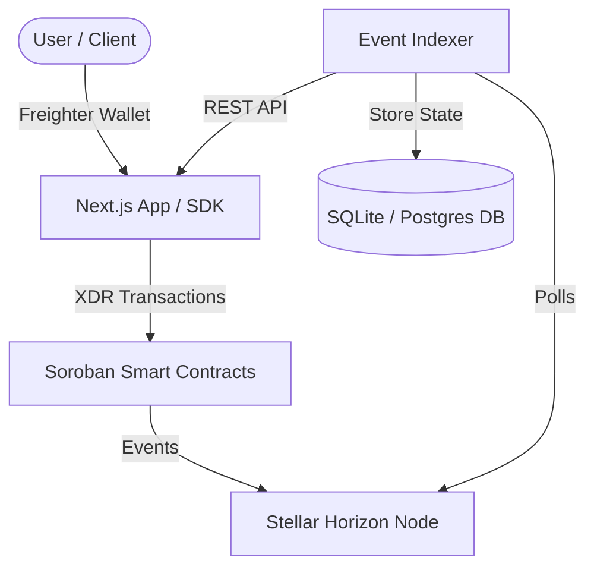

# PayFlow Protocol Architecture

PayFlow Protocol is a decentralized payment management suite built on Stellar's Soroban smart contract framework.

## Core Components

### 1. Smart Contracts (`/contracts`)
- **StreamVault**: Standard time-based token stream. Sender locks funds; recipient claims tokens linearly based on elapsed time.
- **MilestoneEscrow**: Multi-milestone escrow. Sender locks funds; releases are milestone-specific and gatekept by a multi-sig quorum of approvers.
- **StreamFactory**: Factory registry used to deploy new instances of `StreamVault` and `MilestoneEscrow`.

### 2. TypeScript SDK (`/packages/sdk`)
Provides namespaced clients (`StreamClient`, `EscrowClient`, `FactoryClient`) wrapping contract operations. Outputs signed XDR or optionally auto-submits.

### 3. Event Indexer (`/packages/indexer`)
Polls Stellar Horizon for transaction events emitted by PayFlow contracts. Maintains local state in a relational database and exposes query APIs.

### 4. Next.js Web App (`/apps/web`)
A fully-featured dashboard presenting real-time claimable streaming progress, creation wizard, and milestone approval interface.
